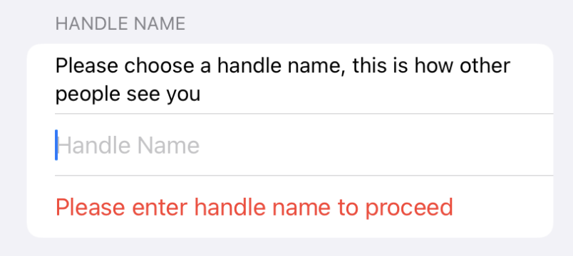
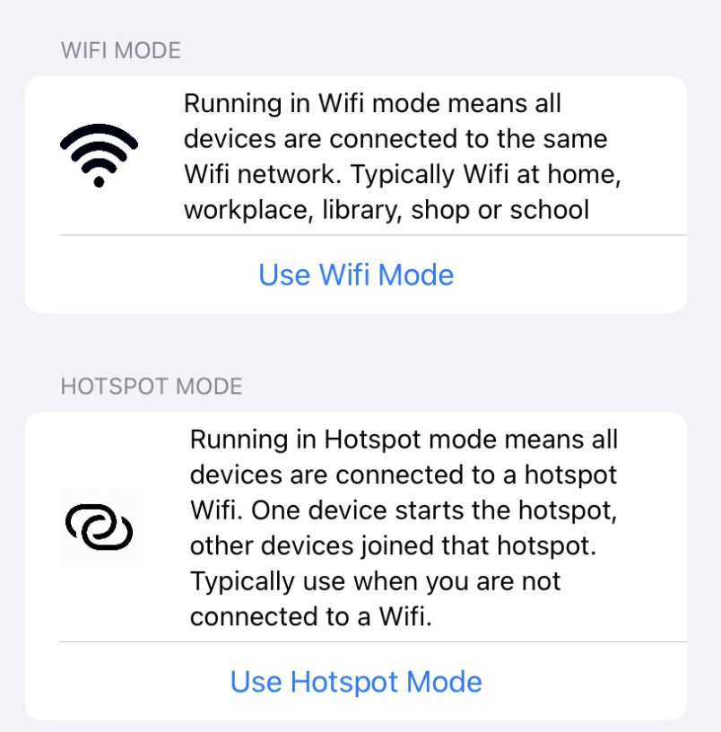
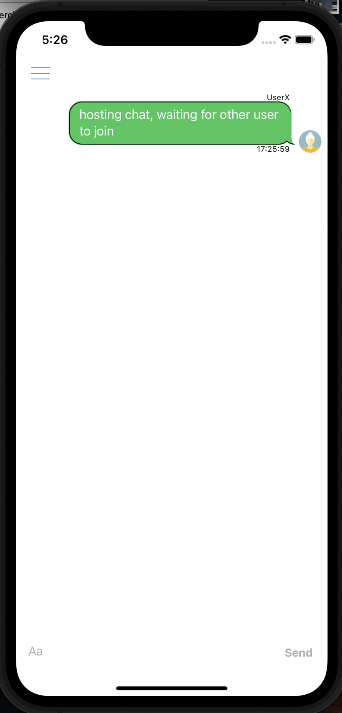
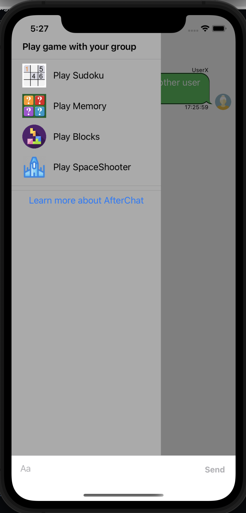

## Welcome to AfterChat Product Page

AfterChat is a chat and mini-game app that works without the Internet. It helps connect people nearby who are connected to the same Wifi network or Device hotspot. This means when you are in situation without Internet such as camping, in a flight, road trip, you can still chat and play a game together. 

### How it works

No login is needed because there's no servers. App connects to each other and work together. There are 2 modes of connection.

- Wifi mode (devices are connected to the same Wifi such as school, library or home)
- Hotspot mode (devices are connected to the same device hotspot when Wifi network in not available)

Wifi mode is preferred as it requires no setup (just make sure devices are connected to the same Wifi network).

All messages are encrypted and there's no privacy issue as no message are kept in the servers or the application.

### Getting Started

When you first launch the app, you are required to give a handle name to identify you (for eg. GoodUser1)

You cannot proceed to connect without entering a handle name. Once handle name is available, you can click either the Wifi mode button or Hotspot mode button. 

Once you click into Wifi modes, it will take a few seconds to find other devices. If no devices found, your app will be run as server mode. Other clients will connect to your app to communication. Make sure all the devices are connected to the same Wifi network or Hotspot in order for this to run.

When connection is completed, you will see a chat screen like this: 

If you are the 1st one, you will just have to wait for others to connect. Once other party join, you can chat with each other. To play mini-game (4 available), you click into top-left menu and you will see the following screen:

When a game is selected, all users will be inform that the game will start in 5 seconds. Users can opt out if they want by clicking cancel button.

### Support or Contact

Please email to ghoststream.corp@gmail.com
